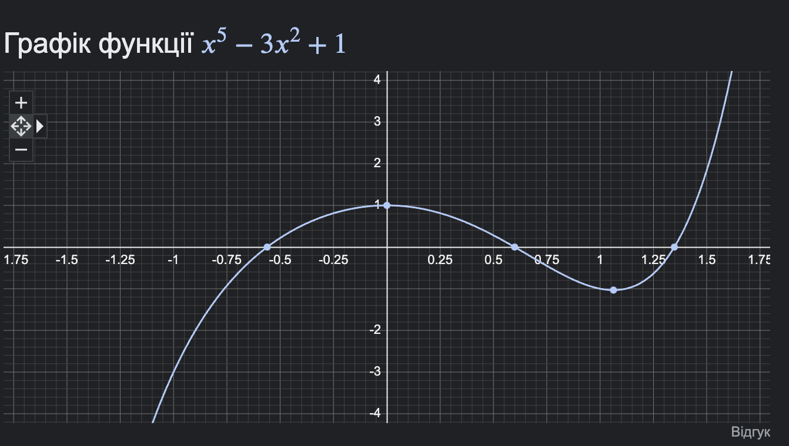

# Знайти методом просто ітерації та модифікованим методом Ньютона

## No. 40

$$x^5-3x^2+1=0$$

# Метод простої ітерації

З графіку видно, щo

1. Перший розвʼязок лежить в інтервалі `[-0.75, -0.5]`
2. Другий лежить в `[0.5, 0.75]`
3. `[1.25, 1.5]`

Оскільки $x != 0$ на усіх проміжках, можемо перейти до рівняння вигляду

$x^4-3x+\frac{1}{x}=0$

І виведемо до виду $x=f(x)$

$f(x)=\frac{x^4}{3}+\frac{1}{3x}$

Переверіми виконання умов на збіжність
$f'(x) = \frac{4x^5-1}{3x^2}$

Оскільки $max(f(x))= q > 1$, то ми не можемо використати тут метод простої ітерації.

# Питанняkv

- Що робити, якщо МПІ не задовільняє умові Ліпшица?
- Що означає знак дельта в умові |x - x\*| < delta?
- Як відрізняється графічно модифікований і звичаний метож Ньютона?
