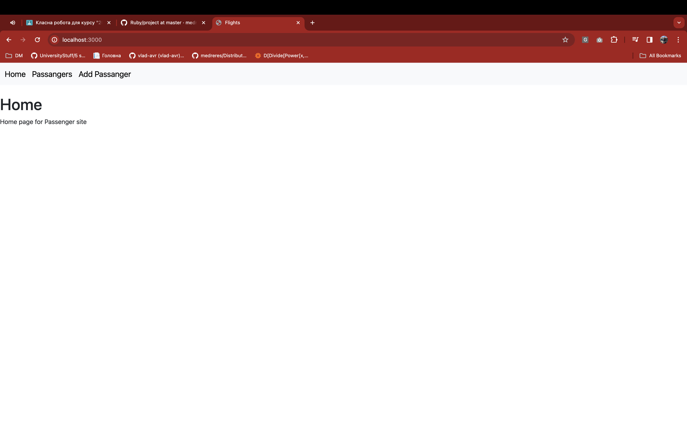
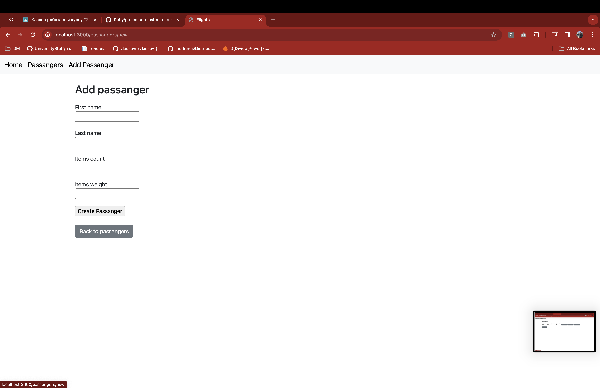
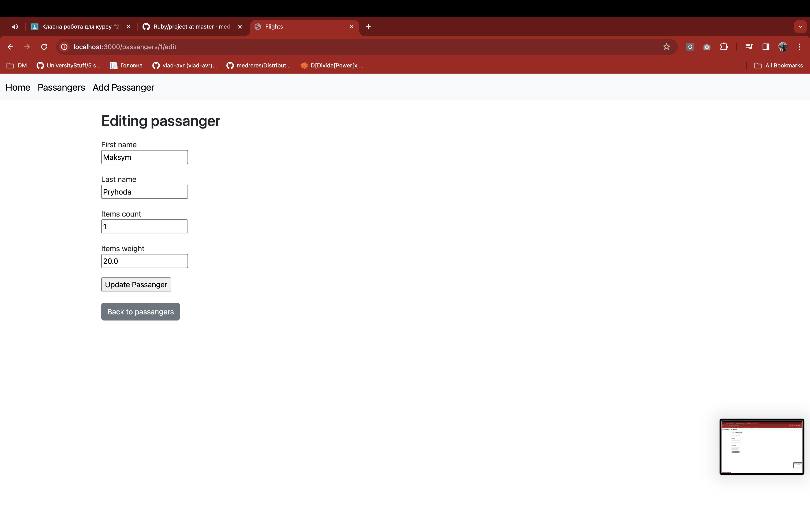
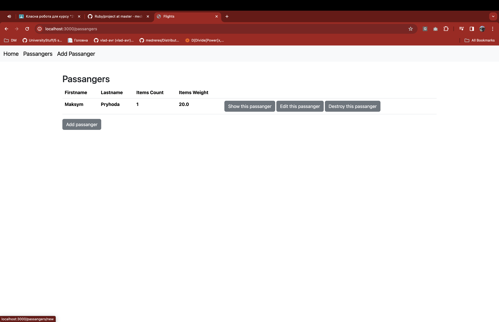

# How to start

# This will install the bundler gem in Ruby 2.5.3

gem install bundler -v 2.0.1

# Install the required gems

Run the command

```zsh
bundle
#or
bundle install

```

# Set up database

```zsh
bundle e rails db:setup
```

# Run the Rails server

```zsh
bundle e rails s
```

# View

## Home page



## Add passenger



## Edit passenger



## View passengers


